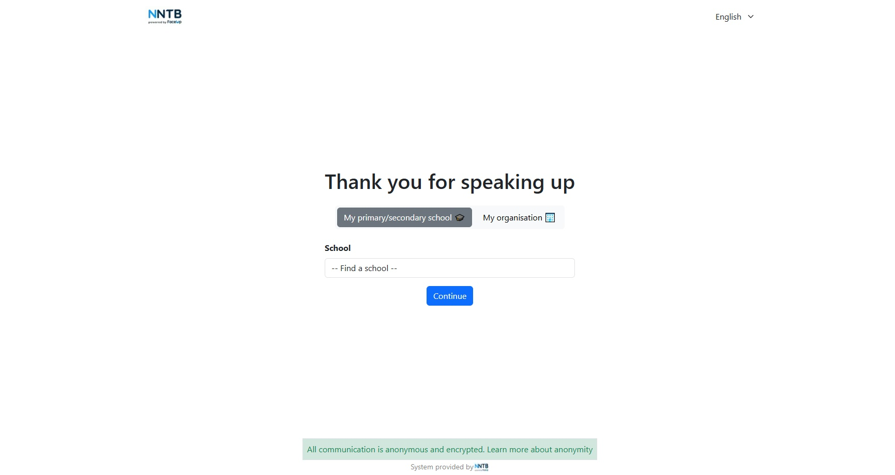
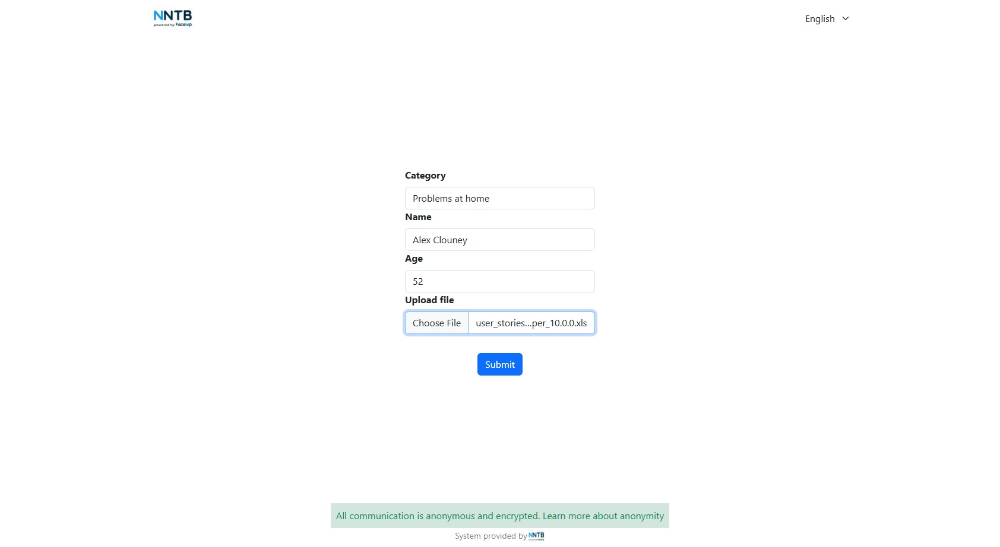
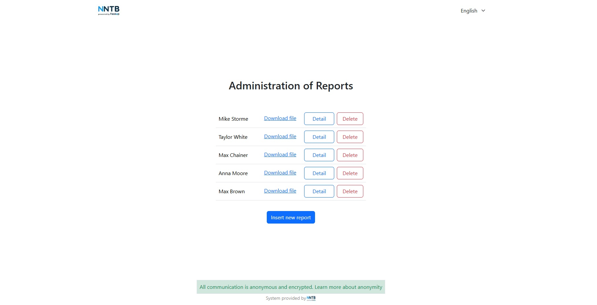

# Report Bullying

This application enables administrators to efficiently manage and review `notifications` from students regarding issues like `bullying`, `learning difficulties`, `family problems`, and `other` concerns. Users can select a category, submit relevant details, and attach files. Administrators can view details, download attached files, and take necessary actions on each report. Users can also switch between languages using the language selector.

**Stack:**
React, Typescript, Node, Express, Zustand, Bootstrap, MongoDB

**Starting the application**
1. Start the MongoDB aplication
2. Start the backend with by entering `npm run devback` in terminal.
3. Start the frontend with `npm start dev` prompt.

